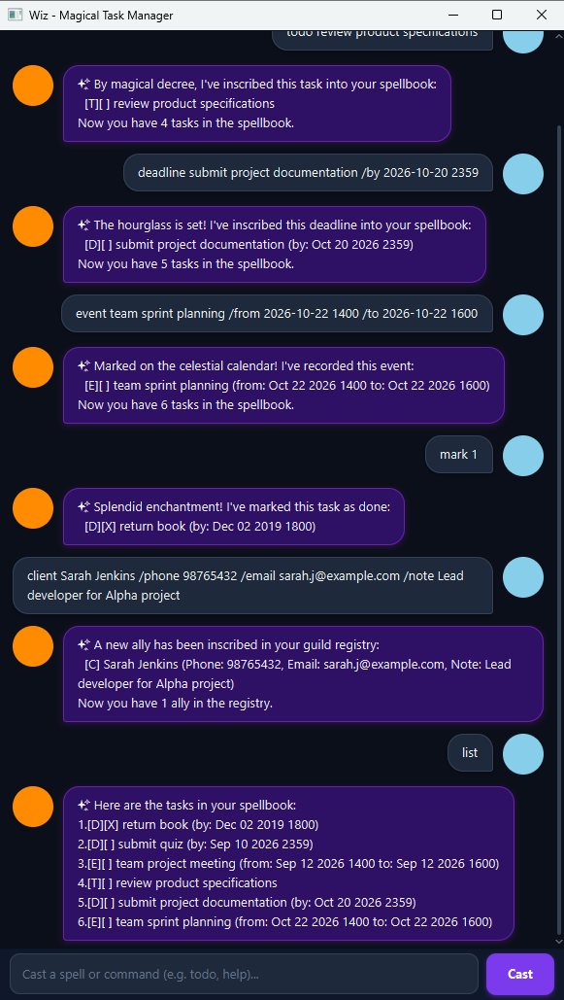

# Wiz - User Guide

**Wiz** is a magical desktop task and contact manager that helps travelers manage tasks, deadlines, gatherings, and client contacts through an intuitive Graphical User Interface (GUI) powered by text commands.



---

## Table of Contents
- [Quick Start](#quick-start)
- [Command Format Conventions](#command-format-conventions)
- [Features & Commands](#features--commands)
  - [Task Management](#task-management)
    - [Adding a To-Do: `todo`](#adding-a-to-do-todo)
    - [Adding a Deadline: `deadline`](#adding-a-deadline-deadline)
    - [Adding an Event: `event`](#adding-an-event-event)
    - [Listing Tasks: `list`](#listing-tasks-list)
    - [Marking a Task: `mark`](#marking-a-task-mark)
    - [Unmarking a Task: `unmark`](#unmarking-a-task-unmark)
    - [Deleting a Task: `delete`](#deleting-a-task-delete)
    - [Finding Tasks: `find`](#finding-tasks-find)
  - [Client Management](#client-management)
    - [Adding a Client: `client`](#adding-a-client-client)
    - [Listing Clients: `clients`](#listing-clients-clients)
    - [Finding Clients: `findclient`](#finding-clients-findclient)
    - [Deleting a Client: `deleteclient`](#deleting-a-client-deleteclient)
  - [Utility Commands](#utility-commands)
    - [Viewing Help: `help`](#viewing-help-help)
    - [Exiting Wiz: `bye`](#exiting-wiz-bye)
- [Data Storage & Auto-Save](#data-storage--auto-save)
- [Command Summary](#command-summary)

---

## Quick Start

1. Ensure that you have **Java 25** (or compatible JavaFX runtime) installed on your computer.
2. Download the latest release `.jar` file or clone the project repository.
3. Launch the application:
   - Using terminal: `./gradlew run`
   - Or running the standalone JAR: `java -jar ip.jar`
4. Type a command into the input box and press **Enter** (or click **Send**).
5. Try typing `help` to see a quick list of available commands.

---

## Command Format Conventions

- Words in `<angle brackets>` are parameters to be supplied by the user (e.g. `todo <description>`).
- Items in `[square brackets]` are optional (e.g. `[/note <note>]`).
- Date and time inputs must strictly follow the `yyyy-MM-dd HHmm` format (e.g., `2026-10-15 1800` for 15 Oct 2026, 6:00 PM).
- Index parameters (`<index>`) refer to the 1-based index numbers shown in the `list` or `clients` view.

---

## Features & Commands

### Task Management

#### Adding a To-Do: `todo`
Inscribes a task without any date or time constraint into your spellbook.

- **Format:** `todo <description>`
- **Example:** `todo read spellbook`
- **Output:**
  ```text
  ✨ By magical decree, I've inscribed this task into your spellbook:
    [T][ ] read spellbook
  Now you have 1 task in the spellbook.
  ```

#### Adding a Deadline: `deadline`
Inscribes a task that must be completed before a specified date and time.

- **Format:** `deadline <description> /by <yyyy-MM-dd HHmm>`
- **Example:** `deadline submit assignment /by 2026-10-15 2359`
- **Output:**
  ```text
  ✨ The hourglass is set! I've inscribed this deadline into your spellbook:
    [D][ ] submit assignment (by: Oct 15 2026, 11:59PM)
  Now you have 2 tasks in the spellbook.
  ```

#### Adding an Event: `event`
Inscribes a task that takes place across a specific time interval. The start time must be before or equal to the end time.

- **Format:** `event <description> /from <yyyy-MM-dd HHmm> /to <yyyy-MM-dd HHmm>`
- **Example:** `event potion brewing workshop /from 2026-10-20 1400 /to 2026-10-20 1600`
- **Output:**
  ```text
  ✨ An enchanted gathering! I've inscribed this event into your spellbook:
    [E][ ] potion brewing workshop (from: Oct 20 2026, 2:00PM to: Oct 20 2026, 4:00PM)
  Now you have 3 tasks in the spellbook.
  ```

#### Listing Tasks: `list`
Displays all current tasks along with their completion status and index numbers.

- **Format:** `list`
- **Output:**
  ```text
  ✨ Here are the tasks in your spellbook:
  1.[T][ ] read spellbook
  2.[D][ ] submit assignment (by: Oct 15 2026, 11:59PM)
  3.[E][ ] potion brewing workshop (from: Oct 20 2026, 2:00PM to: Oct 20 2026, 4:00PM)
  ```

#### Marking a Task: `mark`
Marks a specified task as completed (`[X]`).

- **Format:** `mark <index>`
- **Example:** `mark 1`
- **Output:**
  ```text
  ✨ Spell completed! I've marked this task as done:
    [T][X] read spellbook
  ```

#### Unmarking a Task: `unmark`
Marks a specified task as incomplete (`[ ]`).

- **Format:** `unmark <index>`
- **Example:** `unmark 1`
- **Output:**
  ```text
  ✨ Spell uncast! I've marked this task as not done yet:
    [T][ ] read spellbook
  ```

#### Deleting a Task: `delete`
Banishes a task permanently from your spellbook at the given index.

- **Format:** `delete <index>`
- **Example:** `delete 1`
- **Output:**
  ```text
  ✨ Poof! I've banished this task from your spellbook:
    [T][X] read spellbook
  Now you have 2 tasks in the spellbook.
  ```

#### Finding Tasks: `find`
Searches for all tasks whose descriptions contain the search keyword (case-insensitive).

- **Format:** `find <keyword>`
- **Example:** `find spellbook`
- **Output:**
  ```text
  ✨ Here are the matching tasks in your spellbook:
  1.[T][ ] read spellbook
  ```

---

### Client Management

#### Adding a Client: `client`
Registers a new client or ally with contact information and optional notes.

- **Format:** `client <name> /phone <phone> /email <email> [/note <note>]`
- **Examples:**
  - `client Alice Tan /phone 91234567 /email alice@example.com`
  - `client Bob Lee /phone 98765432 /email bob@example.com /note Lead coordinator`
- **Output:**
  ```text
  ✨ A new ally has been recorded in your ledger:
    [C] Bob Lee (Phone: 98765432, Email: bob@example.com, Note: Lead coordinator)
  Now you have 1 ally in the ledger.
  ```

#### Listing Clients: `clients`
Displays all allies currently registered in your ledger.

- **Format:** `clients`
- **Output:**
  ```text
  ✨ Here are the allies registered in your ledger:
  1.[C] Alice Tan (Phone: 91234567, Email: alice@example.com)
  2.[C] Bob Lee (Phone: 98765432, Email: bob@example.com, Note: Lead coordinator)
  ```

#### Finding Clients: `findclient`
Searches for allies whose name, phone number, email address, or notes match the keyword.

- **Format:** `findclient <keyword>`
- **Example:** `findclient Bob`
- **Output:**
  ```text
  ✨ Here are the matching allies in your ledger:
  1.[C] Bob Lee (Phone: 98765432, Email: bob@example.com, Note: Lead coordinator)
  ```

#### Deleting a Client: `deleteclient`
Removes a client from your ledger using their index number.

- **Format:** `deleteclient <index>`
- **Example:** `deleteclient 1`
- **Output:**
  ```text
  ✨ An ally has been removed from your ledger:
    [C] Alice Tan (Phone: 91234567, Email: alice@example.com)
  Now you have 1 ally in the ledger.
  ```

---

### Utility Commands

#### Viewing Help: `help`
Displays a concise summary of all available commands and spell incantations.

- **Format:** `help`

#### Exiting Wiz: `bye`
Closes the application window safely.

- **Format:** `bye`
- **Output:**
  ```text
  ✨ Farewell, traveler! May your tasks be ever completed. See you again soon!
  ```

---

## Data Storage & Auto-Save

Wiz automatically saves your tasks and client records to local storage after every modifying command:
- **Tasks File:** `data/wiz.txt`
- **Clients File:** `data/clients.txt`

Data files are automatically created if they do not already exist, and are reloaded the next time Wiz starts.

---

## Command Summary

| Action | Format | Example |
|---|---|---|
| **Add To-Do** | `todo <description>` | `todo read spellbook` |
| **Add Deadline** | `deadline <description> /by <yyyy-MM-dd HHmm>` | `deadline essay /by 2026-10-15 1800` |
| **Add Event** | `event <description> /from <yyyy-MM-dd HHmm> /to <yyyy-MM-dd HHmm>` | `event meeting /from 2026-10-20 1400 /to 2026-10-20 1600` |
| **List Tasks** | `list` | `list` |
| **Mark Task** | `mark <index>` | `mark 1` |
| **Unmark Task** | `unmark <index>` | `unmark 1` |
| **Delete Task** | `delete <index>` | `delete 2` |
| **Find Task** | `find <keyword>` | `find book` |
| **Add Client** | `client <name> /phone <phone> /email <email> [/note <note>]` | `client Bob /phone 98765432 /email bob@example.com /note VIP` |
| **List Clients** | `clients` | `clients` |
| **Find Client** | `findclient <keyword>` | `findclient Bob` |
| **Delete Client** | `deleteclient <index>` | `deleteclient 1` |
| **Help** | `help` | `help` |
| **Exit** | `bye` | `bye` |
